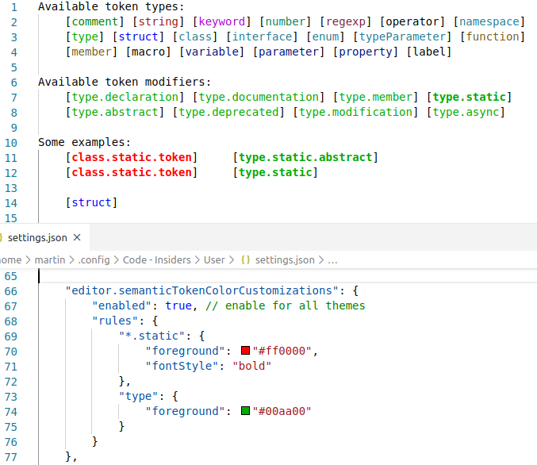

# Racer code coloring Extension
Welcome to the racer code coloring extension test.
This repository contain a short demo for a code coloring extension
dedicated to racer onthology coders. 
Besides code coloring feature it also comes with a semantic checker to
check if the predefined functions have the corect number of parameters (and other correction
checks as well).



## How to run

Launch the extension and open the file `sample/sample.semanticLanguage` and use the following settings:

```jsonc
"editor.semanticTokenColorCustomizations": {
	"enabled": true, // enable for all themes
	"rules": {
		"*.static": {
			"foreground": "#ff0000",
			"fontStyle": "bold"
		},
		"type": {
			"foreground": "#00aa00"
		}
	}
}
```
