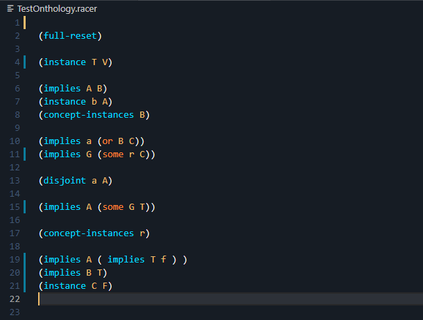
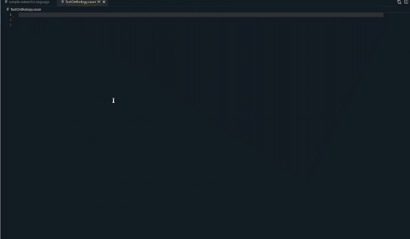

# Racer code coloring Extension
Welcome to the racer code coloring extension test.
This repository contain a short demo for a code coloring extension
dedicated to racer onthology coders. 
Besides code coloring feature it also comes with a semantic checker to
check if the predefined functions have the correct number of parameters (and other correction
checks as well).

## How to run

Clone this repository into your local machine.
Download and install <code>nodejs</code>.
Install npm library manager aswell as <code>typescript</code>.
Press <code>F5</code>

